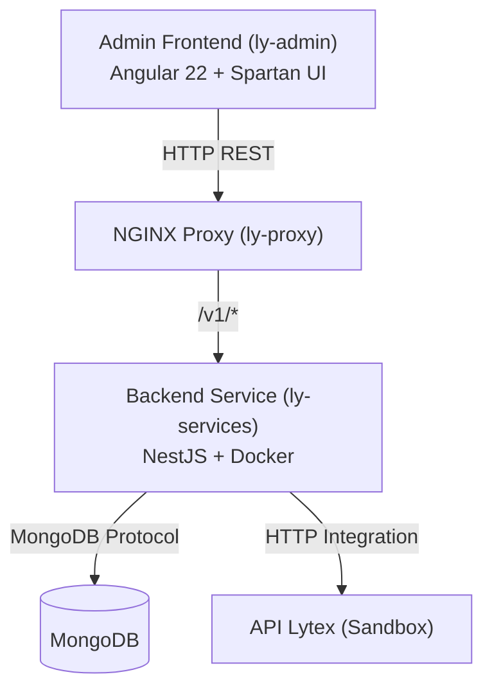

# Desafio Técnico: Sistema de Cobranças integrado à Lytex

Integração fullstack com a API Lytex (NestJS, Angular 22, MongoDB, Docker).

---

## 1. Arquitetura



---

## 2. Repositórios

| Repositório | Tecnologia | Descrição |
| :--- | :--- | :--- |
| **[ly-services](https://github.com/ly-technical-test/ly-services)** | NestJS, Mongoose, Jest | API REST e integração Lytex |
| **[ly-admin](https://github.com/ly-technical-test/ly-admin)** | Angular 22 com Spartan UI | Painel web administrativo |
| **[ly-docs](https://github.com/ly-technical-test/ly-docs)** | OpenAPI 3.0 e Swagger | Documentação de API |
| **[ly-proxy](https://github.com/ly-technical-test/ly-proxy)** | NGINX | Proxy reverso, atualmente apontando apenas para /ly-services |

---

## 3. Requisitos Atendidos

- **Autenticação**: Cadastro, login e JWT.
- **Cobranças**: PIX, Boleto e Cartão de Crédito.
- **Liquidação**: Simulação de pagamento.
- **Interface**: Gestão e emissão de cobranças.
- **Testes Backend**: NestJS + Jest.
- **Testes Frontend**: Angular + Vitest. (básico)

---

## 4. Infraestrutura e Execução

### Komodo e MongoDB
- Estrutura no Komodo e acessos ao MongoDB self-hosted enviados por e-mail.
- [Documentação no ClickUp](https://sharing.clickup.com/90171502657/t/h/86e308m65/FD770VB10PWGUKQ)

### Execução Local

```bash
git clone https://github.com/ly-technical-test/ly-services.git
git clone https://github.com/ly-technical-test/ly-admin.git

cd ly-services
make restart

cd ../ly-admin
npm install
npm run dev
```

- API: `http://localhost:6001/v1`
- Web: `http://localhost:4200`

---

## 5. Testes Unitários

- **Backend**: `cd ly-services && npm test`
- **Frontend**: `cd ly-admin && npm test`
